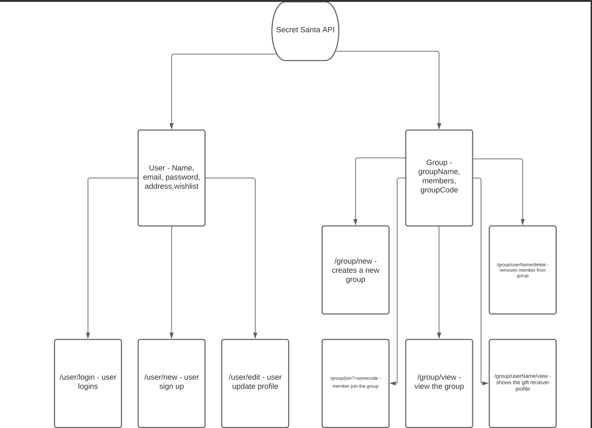
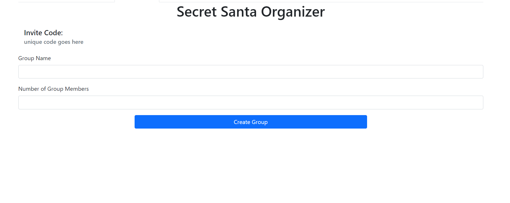
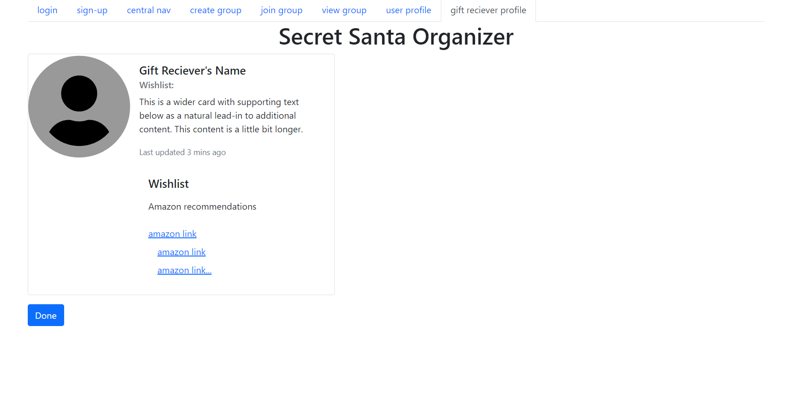
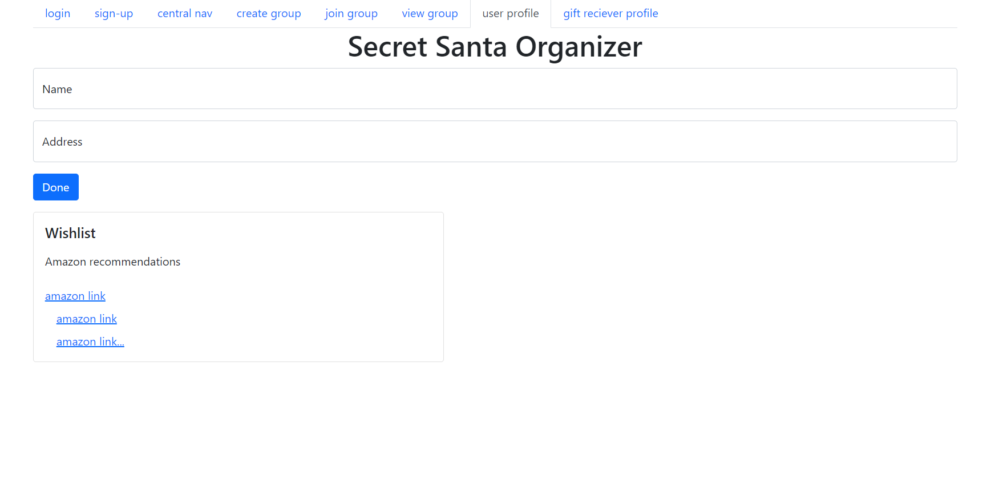
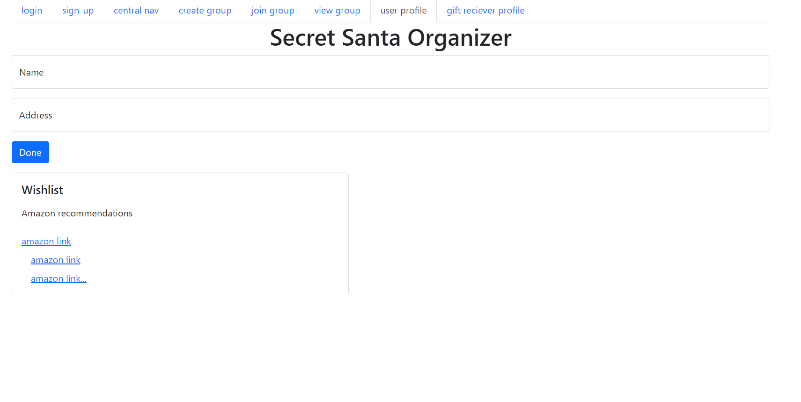

## Part 0


## Part 2 Front-end Implement




## Division of Labor
Part 0 - Jacob Stulgis
Part 1 - Jacob Stulgis and Umar Shafiq
Part 2 - Umar Shafiq
Part 3 - Umar Shafiq - Deployed to https://ssanta0.herokuapp.com/
I had to use my fork to do this (couldn't figure out how to do it from Jacob's original repo).

## Test CRUD endpoints

As a start, we implemented the CRUD endpoint for managing groups.

### List:
```
$ curl https://ssanta0.herokuapp.com/groups

{"message":"success","data":[{"id":1,"name":"Santa's Secret Squad","limit_cents":1000,"deadline":"2021-12-20"},{"id":2,"name":"Snow Sisters","limit_cents":2000,"deadline":"2021-12-24"},{"id":3,"name":"Lights of My Life","limit_cents":3000,"deadline":"2021-12-25"},{"id":4,"name":"The Claus Family","limit_cents":500,"deadline":"2021-11-30"},{"id":5,"name":"Buy Me Something Nice","limit_cents":5000,"deadline":"2021-12-25"},{"id":8,"name":"Jones 2","limit_cents":1000,"deadline":"2021-12-31"},{"id":9,"name":"Jones 2","limit_cents":1000,"deadline":"2021-12-31"}]}
```

### Create a new group
```
$ curl -d "name=Yuletide+Bonanza&limit_cents=8000&deadline=2021-11-20" -X POST https://ssanta0.herokuapp.com/groups

{"message":"success","id":10}
```

### Get a single group by id
```
$ curl https://ssanta0.herokuapp.com/groups/10

{"message":"success","data":{"id":10,"name":"Yuletide Bonanza","limit_cents":8000,"deadline":"2021-11-20"}}
```

### Update a group
```
$ curl -d "name=Yuletide+Bonanza&limit_cents=8000&deadline=2021-11-10" -X PUT https://ssanta0.herokuapp.com/groups/10

{"message":"success"}
```

Check that it's updated:
```
$ curl https://ssanta0.herokuapp.com/groups/10

{"message":"success","data":{"id":10,"name":"Yuletide Bonanza","limit_cents":8000,"deadline":"2021-11-10"}}
```

### Delete a group
```
$ curl -X DELETE https://ssanta0.herokuapp.com/groups/10

{"message":"success"}
```

Now it's gone!
```
$ curl https://ssanta0.herokuapp.com/groups/10

{"error":"group not found"}%
```
